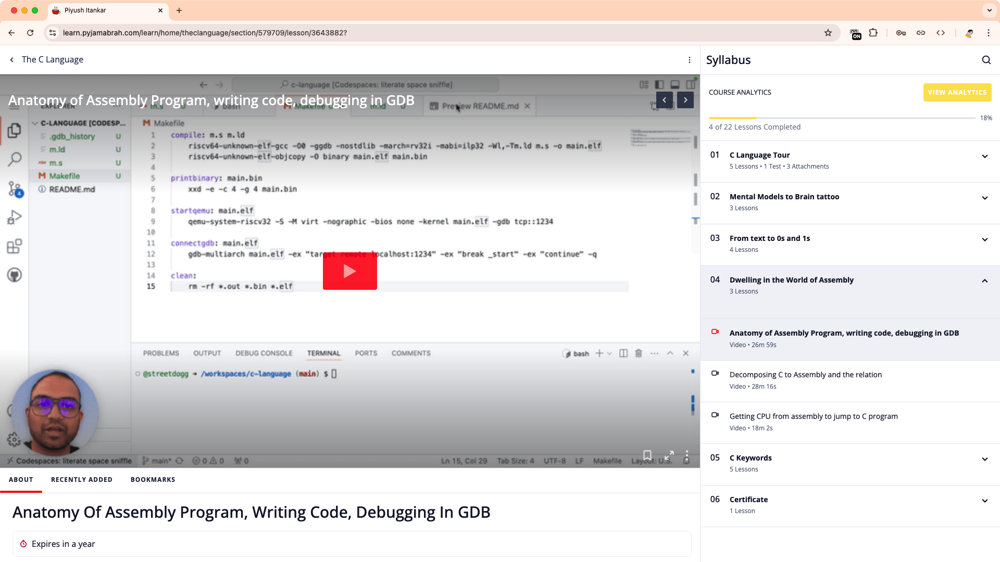
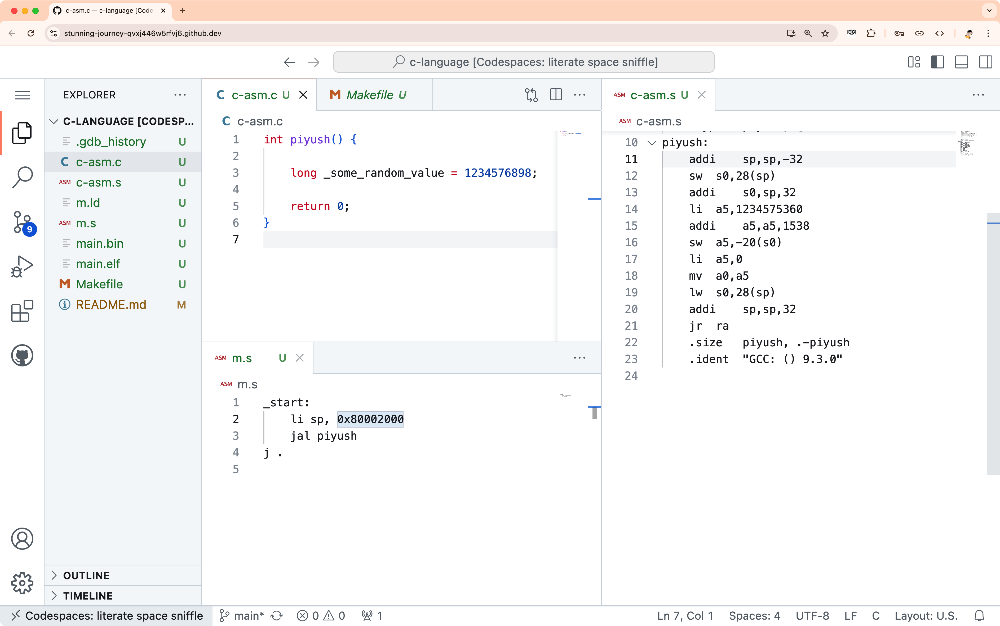
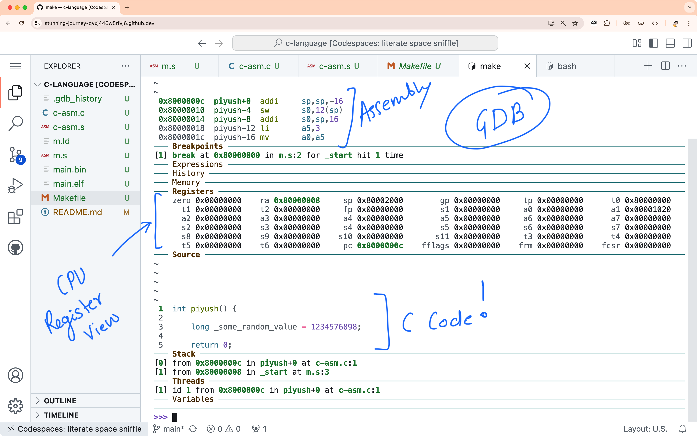
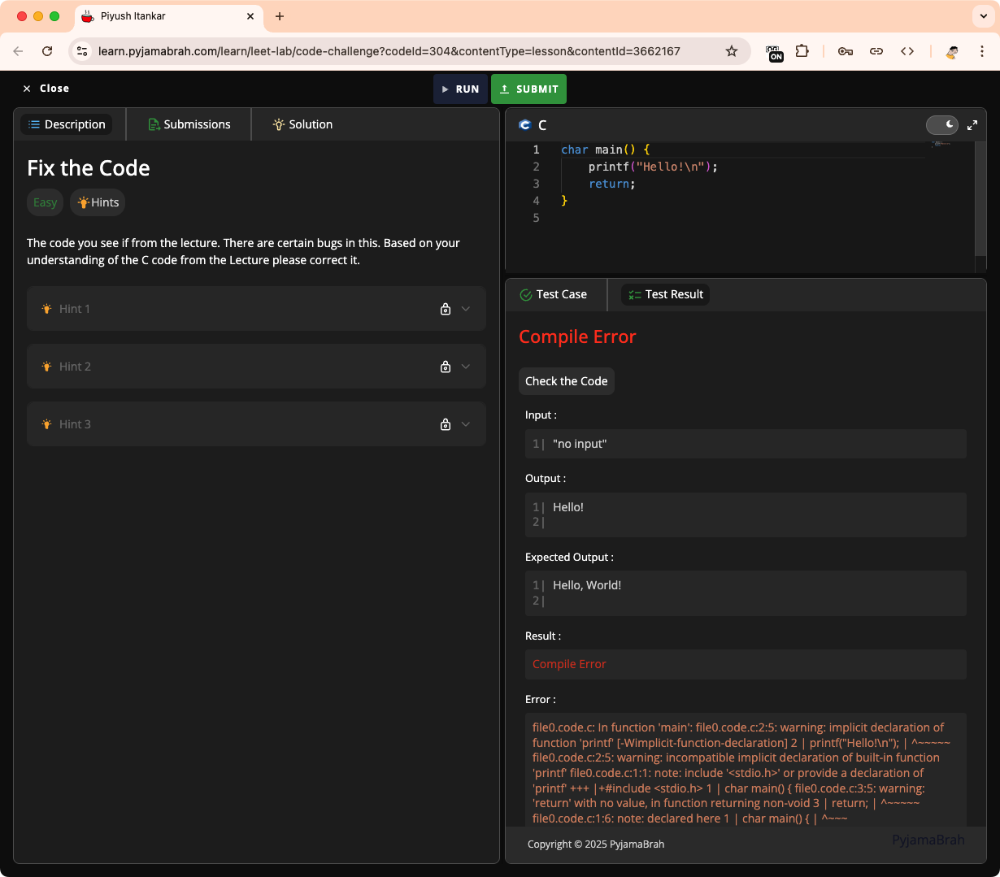
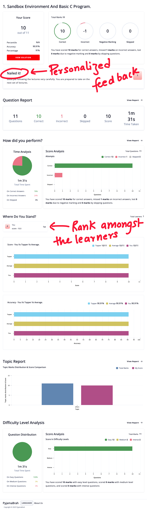

# The Design and Deliberation

There are many courses on the internet. I assure nothing comes close to this! C Language has been my daily driver at work for the past decade, and unlike the kernel developers, I used this language to program CPUs from scratch. This means, I have used the C language in its most RAW form - without any standard libraries. By the end of this course you will have first hand experience of that RAW power and will be able to use this language like a seasoned professional.

Over time, I have learnt that there are more C developers than meets the eye. The general public and students don't necessarily get to see it from where they are.

### Why I created this course?

I have had an interesting observations on repeat over the years - **Most engineers learn and use C the wrong way and this course attempts teach C the right way**. This course is a way to correct that. There is a way to look at the world using C, this course is an attempt to teach that skill.

I have had the wonderful opportunity to host **several interns**, lead **recent college graduates**, mentor **early career professionals** and **interview close to 100 working professionals** from the industry for different lower level positions in my team.

Over time, it dawned on me that although many used C on daily basis not everyone knew how to reason about their code at the System Level. For example, when I ask

> What does the `volatile` keyword in C do?

A common answer is

> It tells the compiler not to optimize out a variable.

While the answer is correct, very rarely people can explain what the implications are! A good answer to the question is -

> The variable is not cached in the CPU registers!

An answer at the CPU level hits very differently and confirms that the engineer has a very deep level of systems level understanding.

This course is very carefully designed to teach and reinforce such system level understanding!

# Learning Portal

The course is structured into Sections which have Chapters, Quizzes, Coding Challenges and Articles within them. Chapters also have a nice description to orient the learner as to what to expect, the Quizzes help reinforce the learnings from the Lectures.

For the Lectures, you have the option to adjust the playback speed from `x0.25` to `x2` depending on what works best for you. The Code I write and explain is also shared as attachments.

# Lectures

I like the old school way of `chalk-and-board` when it comes to explaining the fundamental concepts. Doodles and Scribbling help drive the point home.

The lectures are more of us both sitting together and me explaining you on the paper how things work! I scribble on the screen, digital whiteboard and on the Code on the screen - This (trust me), I believe helps keep your focus on exactly the concept I want you to internalize.

The other thing that I use to ensure you don't struggle with the vocabulary of the language is - **Repeat critical things on repeat throughout the Course!**

# Hands on real world Skills

The course is based on `GitHub codespaces`, which means you will not need any special machine, just access to the internet and chrome browser. We set up the working environment on a Linux powered Cloud Virtual machine available to all GitHub users.

We will install all the toolchain and utilities required in `codespaces`, you personal machine stays untouched. Of course, if you want to setup everything on your machine there are steps for that too!

# The RISC-V ISA and Debugging

I have based the Course on the RISC-V Instruction set Architecture. This architecture has few instructions and helps us focus on learning and not be lost in the detailed nuances of the instructions. Further, there is a huge community out there, support and documentation is available easily.

We learn by converting the C code to Assembly and reasoning about what the system will do as a result. To be able to look into the system, we will use `gdb`.

# Coding Challenges and Reviews

After every important concept there is a coding test, where you fix a given code. Not only this ensures that you have internalized the concepts but also trains you to judge someone else's code (in this case mine). Code reviews at work and when contributing to Open-Source code is an important thing.

The code environment on the platform is set to enforce a delay between every run to ensure you get into the habit of thinking before acting. Once you have fixed the code, the platform will run checks on it and rate you based on the outcome.

# Quizzes and Reports

Quizzes are deliberately based on the content from the lectures. They will test you and force you to very carefully follow each word in the Lectures. These are a way to reinforce the vocabulary, concept and language used and delivered in the Lectures.

As above, after every quiz, a detailed report is generated with a personalized feedback on how well you have done and what you should do or focus on next to master this language.
