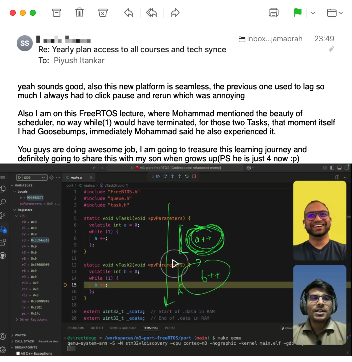
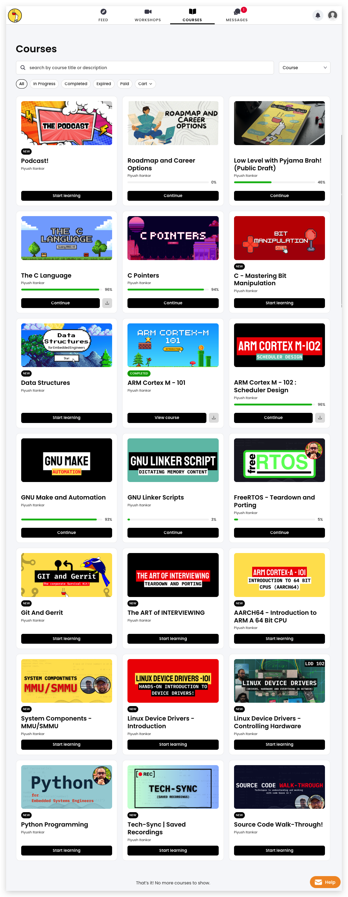
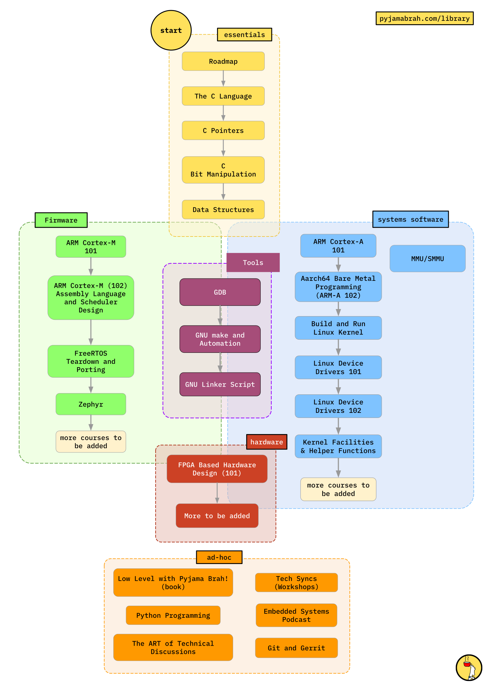

**Important:** Planned courses are not yet ready for learners and will be added as the current recording concludes.

# Email from one of the learners ♥️

# The Philosophy behind the courses?

We have been creating content for the Embedded Software Engineering community for over a year now. If you have been following us, you would know that we have launched courses in the past, with `Firmware Engineering Arsenal` (later renamed to `Firmware Engineering`) being the most popular one. The Courses on `C lnaguage` and `C Pointer` have been an all time hit and got us to where we are.

We noticed that we (a small) team were having a hard time supporting different courses individually. And learners were feeling left out when we included one course in one bundle but not another. To make life easy for all, we have decided to offer all the courses to everyone under **Monthly** and **yearly** subscription plans. This we believe will free us from the complications that come with attended to everyone on different chat windows.

To help reinforce all the learnings and ensure the learner has a deep sense of practical usage of the lessons, we have introduced **Tech Sync (Workshops)** where we present live on topics and take questions.

## Learning Paths - For anxiety free life!

Embedded Engineering has not had a linear path. We are attempting to being order to the chaos. The courses are deliberately designed and ordered in the way they are. You can take each course individually or just follow the learning paths shown in the image below. The ones of the left are for firmware engineers (or aspiring candidates) and the ones on right are for those interested in systems software engineering.

## Firmware Engineering

Firmware Engineering involves working with microntrollers. These are typically 32-Bit CPUs (like ARM Cortex-M, RISC-V RV32 etc) with focus on power saving. Engineers tend to either write `bare metal` code or use an `RTOS` (like FreeRTOS, Zephys, ThreadX etc) if there is a need to handle complicated state machines.

Having a good understanding of what the CPU does as the result of the C code is a skill that will put you in the top 1% of the entry level Firmware engineers. Being able to understand a senior and co-operate to write the code is more than enough. Notice that the `C language` and `C Pointers` course will exactly help you become this. The `C Language` course is all about insights and based on the RISC-V CPU. So not only do you learn C the way it should be (by being able to reason down to the CPU) but also you learn programmers model and assembly for the RISC-V CPU. Double win!

The ARM Cortex-M 101/102 Introduces the ARM-M Architecture and focuses on booting and programming the CPU in Assembly. You will write a secheduler in assembly as part of these courses, this is deliberate and makes way for understanding FreeRTOS which follows. Going through these courses, you will notice how similar the RISC-V and ARM-M architectures are. By the end of the ARM courses, you will be having the skills of a senior firmware engineer.

The FreeRTOS course is laser focused on tearing down and reasoning about the scheduler and the OS primitives (mutex, semaphores etc). There are many engineers who work with FreeRTOS on a daily basis but don't understand the internals and thus, hit a glass-roof in their journey. Being able to reason about OS constructs like mutex, semaphore, spinlocks etc is important. You will also learn the rare skill of porting FreeRTOS from scratch on a new ARM-M target!!

To grow up the ladder you will need to master the CPU's programmer model, architecture and be able to use the toolchain (gcc, ld, as, ar, gdb etc) to place the code/data in the memory, debug the solution and write build automation help.

Senior or Staff level engineers worry about details like power, performance, stability and fault tolerance of the firmware. Being an absolute master of C, CPU Architecture, Operating Systems and Debug tools is a must! If you notice, the courses are lined up to get you to becoming a master...

## Systems Engineering

Stellar Systems Software Engineers are firmware engineers who are working with Application Grade CPU (ARM Cortex-A, RISC-V RV64, AMD, Intel etc), Complex and interconnected system capable of running Higher Level Operating System (Linux, Mac-OS, Windows etc), Hypervisors and Virtualizer and Systems capable of running general applications like the chrome browsers.

The Application processors are complicated in their architecture and have layers privileges and modes. Systems Engineer need to have a good understanding of the CPUs to be able to reason about the systems level on-goings. They are involved in working with Bootloaders, hypervisors, OS Kernel (Linux, Windows etc) and need to be very thorough with the understanding of the Operating Systems.

The courses included focus on the ARM Cortex-A (aarch64) and RISC-V RV64 architectures. The introductory courses give a over all view of the given architecture. Once the architecture is understood, the next in line is the Linux Device Drivers. The 101 course, provides a deep insight into how the Linux Kernel Drivers work and the anatomy of a general character driver.

We focus on the ARM-A class CPUs just because they are very popular and used in Mobiles, Watches, Tablets, Desktops/Laptops and Servers!

## General Skills

Honing technical skills is not enough. For these reasons we have included courses on general skills that a Firmware/Systems Software Engineer should have. When working in teams, collaboration is a big one and most semiconductor companies use tools like Git and Gerrit for source code management. Master these will enable you to be a reliable teammate!

`The ART of Technical Discussions` is a collection of special topics and experiences that will arm you with the knowledge and mindset to have a productive technical discussions with s seniors!

# More!

We will be adding more courses in the paths so eventually this becomes a robust and reliable path to take as to become a firmware or systems software engineer. The subscribers of course will get the updates for free :)

# Our Recommendation

Unless you are a student or an early professional who cannot afford the Yearly plan, our recommendation is to go for the Yearly Subscription to get the most bang for the buck.
